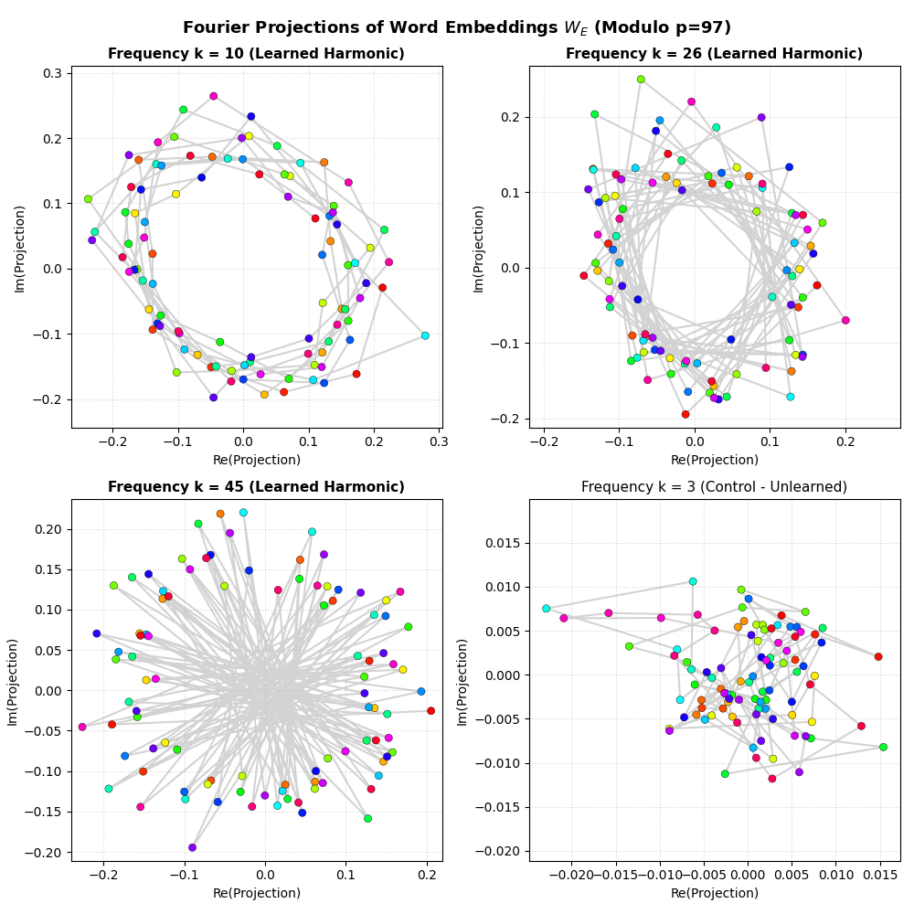
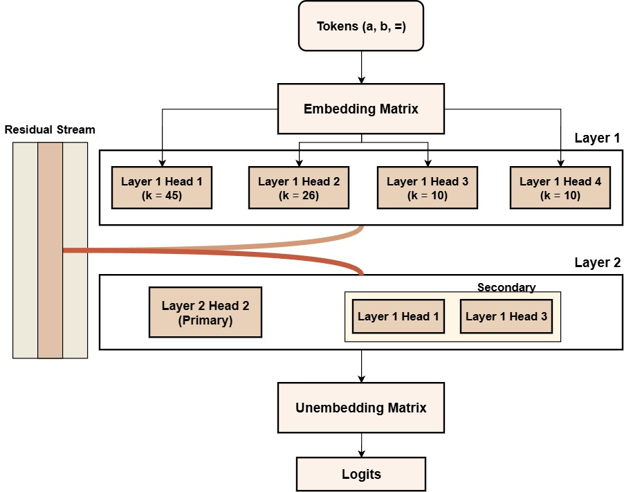

# Mechanistic Interpretability on a Custom 2-Layer Transformer

This repository contains a mechanistic interpretability study on a custom-built, attention-only 2-layer GPT model trained from scratch to perform modular addition (a + b (mod 97)).  
The goal of this project was to build the architecture from the ground up, reproduce the delayed generalization phenomenon known as **grokking**, and mathematically reverse-engineer the specific attention circuits the neural network learned to solve the task. This work serves as an independent reproduction of the core methodologies outlined in **[Nanda et al.'s](https://arxiv.org/abs/2301.05217)** "Progress measures for grokking via mechanistic interpretability".

---

## Technical Progress & Findings

### Step 1: Reproducing Grokking
* **Model Configuration:** A tiny 2-layer (`num_blocks=2`), 4-head (`num_heads=4`), embedding dimension 128 model. The feed-forward MLP layers were disabled (`use_mlp=False`) to keep the residual stream linear for interpretability.
* **Regularization & Training:** Trained using AdamW with high weight decay (`weight_decay=1.0`) on 35% of the 9,409 possible addition pairs, holding out 65% for validation.
* **Observation:** The model overfitted the training set initially (100% train accuracy, ≈1% validation accuracy). Under continued weight decay constraint, the model transitioned to a generalizing circuit, grokking the task to reach 100% validation accuracy.

### Step 2: The Logit Lens
* **Mechanism:** Registered forward hooks on the residual stream at each layer: `layer_0` (embeddings), `layer_1` (Block 0 output), and `layer_2` (Block 1 output). Projected intermediate activations directly into vocabulary space.
* **Findings:** Proved systematically over the 6,116 validation equations that Layer 0 (embeddings) and Layer 1 (Block 0) hold near 0% prediction accuracy, demonstrating that the final modular sum is realized and mapped to the residual stream at Layer 2 (Block 1 output).

### Step 3: Activation Patching
* **Mechanism:** Intercepted the forward pass of corrupted prompts (e.g., changing operand a or b) and patched in the attention head outputs (`z` activations) from clean runs to measure the recovery in logit difference.
* **Specialization Findings (Single Prompt):**
  * Swapping operand b (`12 45 =` vs. `12 23 =`) identified `L0H3` and `L0H1` as the key movers of b. Patching `[(0, 1), (0, 3), (1, 1)]` restored target prediction to **92.11%**.
  * Swapping operand a (`12 45 =` vs. `23 45 =`) identified a different circuit `[(0, 1), (0, 2), (1, 0), (1, 1)]` (**94.90%** recovery), proving position specialization.
  * Changing b to a different delta (`12 45 =` vs. `12 33 =`) required patching all Layer 0 heads (**96.20%**), showing that circuits are Fourier-frequency dependent.
* **Global Circuit Findings (Batched 100 Prompts):**
  * **Layer 0 is globally distributed:** To recover operands consistently across all prompts, all 4 heads in Layer 0 must be patched, acting in parallel to route distinct Fourier components.
  * **Layer 1 Computes Positional Harmonics:** **`L1H1`** is the global compute center (averaging ≈+8.55 shift). **`L1H0`** specializes in computing a-corruptions, while **`L1H3`** specializes in computing b-corruptions. Patching `All L0 Heads + L1H3, L1H1, L1H0` provides **82%-85%** global mathematical recovery.

### Step 4: Representational Fourier Projections & Frequency Tuning
To mathematically validate the mechanism, we extracted weights directly from the trained checkpoint and analyzed the geometric embedding layout and head frequency profiles.

#### 1. Representational Fourier Projections (The Hyper-Torus)
Because the model represents modular addition using multiple distinct frequencies simultaneously (k ∈ {10, 26, 45}), the embedding matrix W<sub>E</sub> forms a **multi-dimensional torus** in 128 dimensions. Standard 2D PCA projects the entire torus, mixing the frequencies and yielding an overlapping, tangled trajectory. 

To resolve the circles, we project the centered embeddings W<sub>E</sub> onto the real and imaginary parts of its own k-th Fourier coefficient vector F<sub>k</sub> = DFT(W<sub>E</sub>)<sub>k</sub> ∈ ℂ<sup>128</sup>:

> X<sub>k</sub> = W<sub>E</sub> · Re(F<sub>k</sub>), &nbsp;&nbsp; Y<sub>k</sub> = W<sub>E</sub> · Im(F<sub>k</sub>)

This isolates the 2D circular subspace for each frequency component:
* **Learned Frequencies (k = 10, 26, 45):** Form **perfect, clean circles** where the radius shows the representation's strength.
* **Control Frequency (k = 3):** Collapses into a tight cluster, proving the representation is highly selective.



#### 2. Fourier Frequency Tuning of Attention Heads
By computing the Fourier transform of the attention scores along modular diagonals, we identified the resonant frequency of each Layer 0 attention head:
* **Layer 0, Head 0:** Tuned to frequency **<i>k</i> = 45**
* **Layer 0, Head 1:** Tuned to frequency **<i>k</i> = 26**
* **Layer 0, Head 2:** Tuned to frequency **<i>k</i> = 10**
* **Layer 0, Head 3:** Tuned to frequency **<i>k</i> = 10**

---

## How the Transformer Computes Modular Addition

The model solves modular addition by implementing a trigonometric addition formula inside its weights. 



### The Algorithm:
1. **Embedding Phase (W<sub>E</sub>):** The input tokens <i>a</i> and <i>b</i> are mapped to a torus, placing them at specific phase coordinates &omega;<sub><i>k</i></sub><i>a</i> and &omega;<sub><i>k</i></sub><i>b</i> for <i>k</i> &isin; {10, 26, 45}, where &omega;<sub><i>k</i></sub> = 2&pi;<i>k</i> / 97.
2. **Layer 1 Attention:** The 4 attention heads act as bandpass filters tuned to specific frequencies. They align the phase difference between the operands and write cos(&omega;<sub><i>k</i></sub><i>a</i>), sin(&omega;<sub><i>k</i></sub><i>a</i>), cos(&omega;<sub><i>k</i></sub><i>b</i>), and sin(&omega;<sub><i>k</i></sub><i>b</i>) coordinates to the residual stream.
3. **Layer 2 Attention:** The computation heads (`L2H2`, `L2H1`, `L2H4`) compute the rotated sum via bilinear query-key matching. Using the trigonometric identity:
   
   > cos(&omega;<sub><i>k</i></sub>(<i>a</i> + <i>b</i>)) = cos(&omega;<sub><i>k</i></sub><i>a</i>)cos(&omega;<sub><i>k</i></sub><i>b</i>) &minus; sin(&omega;<sub><i>k</i></sub><i>a</i>)sin(&omega;<sub><i>k</i></sub><i>b</i>)
   
   the model performs modular addition by multiplying sines and cosines.
4. **Unembedding Phase (W<sub>U</sub>):** The output projection W<sub>U</sub> acts as a phase detector, mapping the rotation back to the token coordinate corresponding to <i>a</i> + <i>b</i> (mod 97).

---
## Getting Started

### Installation
Clone the repository and install the dependencies:
```bash
pip install -r requirements.txt
```

### Running the Scripts
1. **Train the Model:**
   ```bash
   python scripts/run.py
   ```
2. **Logit Lens (Single & Batched):**
   ```bash
   python scripts/logit_lens.py
   python scripts/logit_lens_batched.py
   ```
3. **Activation Patching Sweep:**
   ```bash
   python scripts/activation_patching.py
   python scripts/patching_batched.py
   ```
4. **Embedding Projections and Fourier Visualizations:**
   ```bash
   python scripts/addn_visualizations.py
   ```
